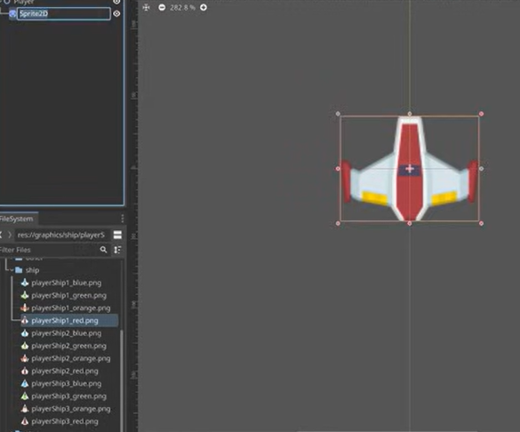

# Entry 1: Choosing the Project Idea and Tool
##### 11/3/25

### Tool and Project
For the *APCSA Freedom Project*, I chose to learn make a car racing game. I chose this because I like cars and racing and I also liked how my soccer game from last year turned out but hope I can do better this year. The tool I chose to learn is ***[Godot](https://godotengine.org/)*** because it is a good engine for 2D or 3D games which I want to make. I chose ***Godot*** over *[GDevelop](https://gdevelop.io/)* because I spent more time looking into ***Godot*** and I felt that it fit my project ideas better.

#### Tinkering
To start getting familiar with ***Godot***, I watched some tutorial videos and tried to follow the tutorials.
* First, I watched 10 minutes of a "[How to make a Video Game - Godot Beginner Tutorial](https://www.youtube.com/watch?v=LOhfqjmasi0)" video. The main takeaways were that making a game is combining and extending **nodes** to get the result we want and **scenes** allow us to bundle nodes together into reusable packages.
* Then I watched 10 minutes of "[Coding in Godot](https://www.youtube.com/watch?v=8CrFk3tjsSY)", a tutorial video which is part of a crash course on ***Godot***. I learned that ***Godot*** uses multiple languages and simplest one is GDScript which is similar to Python.
  * You always attach a script to a node and that script can change the attributes of the node.
    * You can change the position, size, color, texture, rotation, or anything the node has in its inspector.
  *  The grid(x, y) starts from the top left(0, 0).
* I was able to download ***Godot*** on my laptop and also watched a full video on "[The Basics](https://www.youtube.com/watch?v=q7wlSvt0JIc&list=PL4cUxeGkcC9iHCXBpxbdsOByZ55Ez4bgF)" which is part of the crash course.
  * I followed along with the video explaining some of the concepts in Godot along with how to create and manipulate things for scenes and nodes.
  * For the tutorial, I imported some images and audio in the form of folders that contain multiple files and used some to make the meteors and spaceship for the project in the video.
 

### Engineering Design Process
Right now, I am in the first stage of the engineering design process which is defining the problem. The problem is figuring out how I can use my tool to build the racing game. I am moving onto the next step which is researching the problem where I am going to plan out how I want the game to work and how I can learn and incorporate *Godot* into it.

### Skills
A skill I have improved on is **Communication**. Over the past couple of months, I had a lot of group work and presentations. In the beginning of the year, I felt nervous because I was working with new people and I didn't really like speaking a lot, especially in front of a lot of people. However, as we spent more time together and preparing, I felt better about my ability to speak and communicate ideas.

**How to Google** is another skill I have developed further. In my Quality of Life class, I had to find articles on my topic. These articles had to answer the guiding questions and had to be recent and credible. The more credible articles come from ".gov" or ".edu" which were hard to find. After a lot of struggle and change in keywords, I was able to find good ones and found it easier to search for credible sources.

[Next](entry02.md)

[Home](../README.md)
