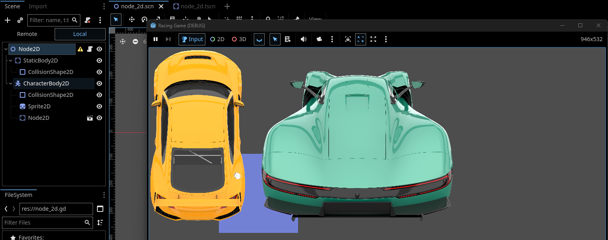

# Entry 4: MVP Progress
##### 3/15/26

### Tool Learning
So far, my partner and I have been trying our best to keep up with our MVP goals. We are currently trying to find ways to create our racers and our background for the track. To begin, I tried to create a scene with possible cars we could use in our game. I made a [Main Scene](../tool/Main-car-scene.png) with the yellow car and a [second scene](../tool/Green-car-scene.png) for the green car and added the other scene to the main. Afterwards, I tried to learn how to add [shapes](https://www.youtube.com/watch?v=PLcTuSe264g#:~:text=how%20to%20create%20custom%20collision%20shapes%20with,polygon2d%2C%20custom%20collision%20shape%2C%20custom%20shape%2C%20collision) in Godot by watching some videos. We plan to use shapes for the background of the race track. As a start, I used a [Script](../tool/Shape-Script.png) to write the code for a shape which was a square. After, I ran the entire Main scene and got a full scene.

 
Using [Godot](https://godotengine.org/) and my [learning log](https://github.com/bryanc8776/apcsa-freedom-project/blob/main/tool/learning-log.md), I was able to understand more of the features available. I had to play around with the positon of the cars and their size/scale so that they can fit in the scene once I ran it.

### Engineering Design Process
I am on Step 4 of the engineering designing process. My partner and I have planned out what we want to do and need to do in order to create our MVP. With our learning so far, we are moving onto Step 5 which is to create a prototype in which we will try to finish our MVP.

### Skills
A skill I have improved on is **How to Google**. In the INFY App Design Challenge, our team's topic is undistracted crashes. Initially, we would search for apps that try to address and improve safe driving. However, we mainly had to search for apps that address distracted driving accidents as our main goal is to reduce that and we need to know what we others don't have so we can add it to our app. Along with this, I have also improved on **Leadership**. My group chose me to be the leader of the team. I have to submit our deliverable on time through email and make sure we each do something in the project. So far, we have been collaborating well and I have been able to submit everything on time.

[Previous](entry03.md) | [Next](entry05.md)

[Home](../README.md)
