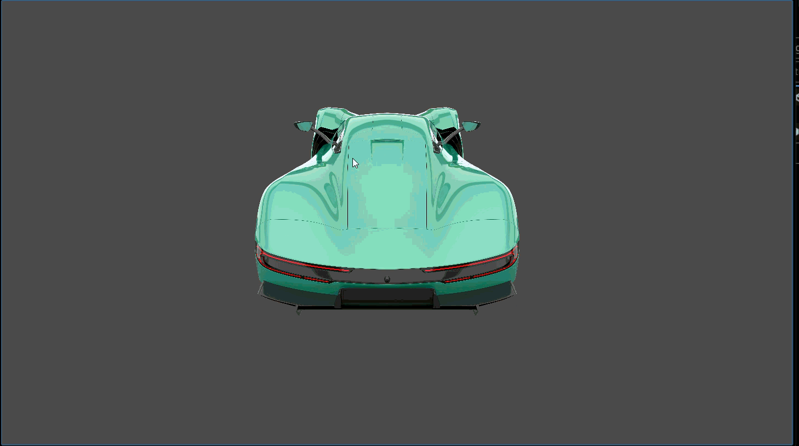

# Tool Learning Log

## Tool: **Godot**

## Project: **[Racing Game](https://godotengine.org/)**

---

### 10/5/25:
* Watched 10 minutes of [this](https://www.youtube.com/watch?v=LOhfqjmasi0) video on how to make a game with godot
  * Making in game is combining and extending **nodes** to get the result we want.
  * **Scenes** allow us to bundle nodes together into reusable packages
* We have to download Godot to use it

### 10/20/25:
* Watched 10 minutes of [this](https://www.youtube.com/watch?v=8CrFk3tjsSY) tutorial video which is part of a crash course on Godot.
  * Godot uses multiple languages. The simplest one is GDScript which is similar to Python.
  * You always attach a script to a node and that script can change the attributes of the node.
    * You can change the position, size, color, texture, rotation, or anything the node has in its inspector.
  *  The grid(x, y) starts from the top left(0, 0)
*  I also tried to download the Godot Engine but it didn't work so I'll have to check that.

### 11/2/25:
* Watched [this](https://www.youtube.com/watch?v=q7wlSvt0JIc&list=PL4cUxeGkcC9iHCXBpxbdsOByZ55Ez4bgF) full video which is part of the crash course.
  * I figured out how to run Godot on my laptop and got my own project.
  * Followed along with the video explaining some of the concepts in Godot along with how to create and manipulate things for scenes and nodes.
  * Imported some images and audio in the form of folders that contain multiple files. Used some to make the meteors and spaceship for the project in the video.
* I plan on following [this](https://docs.godotengine.org/en/stable/getting_started/first_2d_game/index.html) step-by-step 2D-game tutorial to get a better sense of the different functions and concepts in the project folder.

### 11/16/25:
* I started the [step-by-step 2D-game tutorial](https://docs.godotengine.org/en/stable/getting_started/first_2d_game/index.html)
  * We created a `Player` parent node and added two child nodes, `AnimatedSprite2D` and `CollisionShape2D`
  * Imported folders with files of images for the player and enemies
    * Used the `player` images to display the `player` and show animation effects
  * I also learned a lot of new things like how to [add animations](Adding_animations.png) based on user/keyboard-input and write code in the [GDScript](GDScript_code.png) to make the scene more interactive.
* The next step will be to continue with the tutorial and create the enemies.

### 11/23/25:
* I continued working on the tutorial project by adding the [enemies](https://docs.godotengine.org/en/stable/getting_started/first_2d_game/04.creating_the_enemy.html)
  * This had steps that were similar to the `player` scene but I forgot how to add some things like animations and grouping nodes so I went back to the [player doc](https://docs.godotengine.org/en/stable/getting_started/first_2d_game/02.player_scene.html) and the `player` scene we made which made it easier.
  * To get an element from an array in GDScript, we use `array_name.pick_random()`
  * Something new I did was [connect a signal](Node_signal_connection.png) of a child node called `VisibleOnScreenNotifier2D` to the main/parent `Mob` node and use this in the `Script`.
* I plan on finishing this game in the next week or so. 

### 12/7/25:
* I was able to get the [`Main`](tutorial_main_scene.png) scene to work where the game is functioning as needed.
  * I had forgotten how to add a scene. I thought it would be the `+` in the scene dock but that adds a child node. I went back to earlier in the tutorial and remembered that we need to click that `Scene` at the top left above the Scene dock to add a new scene.
  * The [`Main` scene](main-scene_dock.png) doesn't have to be a `Node2D` because we are mainly just putting the other nodes like `Player` into it which are already `2D` so they have the physics.
  * [Here](tutorial_timer_code.png) is the main code we did. We added `timer`s as child nodes of the `Main` scene to control when the game/mob starts.
* I just need to add more user-interface with the score, title screen, and more.

### 12/14/25:
* I added the user-interface part of the [game](UI-tutorial.png) and also learned a lot while going through this section.
  * The `CanvasLayer` node, a type of `Control` node, lets us draw our UI elements on a layer above the rest of the game, so that the information it displays isn't covered up by any game elements.
  * `Control` nodes have a position and size, but they also have [anchors](Adding-Anchors.png). Anchors define the reference point for the edges of the node.
* The next step would be to make a plan to start our actual game with my partner now that we have a pretty good understanding of how Godot works.

### 3/8/26:
* So far, my partner and I have been trying our best to keep up with our MVP goals.
  * To begin, I tried to create a scene with possible cars we could use in our game.
    * I made a [Main Scene](Main-car-scene.png) with the yellow car and a [second scene](Green-car-scene.png) for the green car and added the other scene to the main.
  * I also tried to learn how to add [shapes](https://www.youtube.com/watch?v=PLcTuSe264g#:~:text=how%20to%20create%20custom%20collision%20shapes%20with,polygon2d%2C%20custom%20collision%20shape%2C%20custom%20shape%2C%20collision) in Godot by watching some videos. I plan to use shapes for the background of the race track.
    * As a start, I used a [Script](Shape-Script.png) to write the code for a shape which was a square.
 * After, I ran the entire Main scene and got a [full](Complete-scene.png) scene.

### 3/22/26:
* I tried to create our player.
  * For the green car, I added a [Script](keyboard-movement.png).
  * The Script had code that determined the velocity of the player and the changes based on the key pressed.

  * Here is a gif that shows the code worked.
  * We need to add similar code for the computer racers
* I was trying to do something with shapes to make a [background](track-scene.png) for the track but had no luck.

### 3/23/26:
* I went over the [Nodes and Scenes](https://docs.godotengine.org/en/stable/getting_started/step_by_step/nodes_and_scenes.html) and [Creating Instances](https://docs.godotengine.org/en/stable/getting_started/step_by_step/instancing.html) documents in Godot.
  * This helped me remember how to ultimately make a full game scene and make separate nodes work and connect.
 
### 3/29/26:
* I was looking for other car images and decided to uses some from [Vecteezy](https://www.vecteezy.com/search?qterm=top-view-cars&content_type=png&license-free=true).
  * This would be more like the yellow-car, so we won't use the green-car anymore.
* I added the cars to my Godot
  * Created the separate scenes for them( & )
  * Added a separate script for each but used the same code as the green-car had for UI movement.
  * I need to change it so it moves by itself as they would be computer racers.
<!--
* Links you used today (websites, videos, etc)
* Things you tried, progress you made, etc
* Challenges, a-ha moments, etc
* Questions you still have
* What you're going to try next
-->
